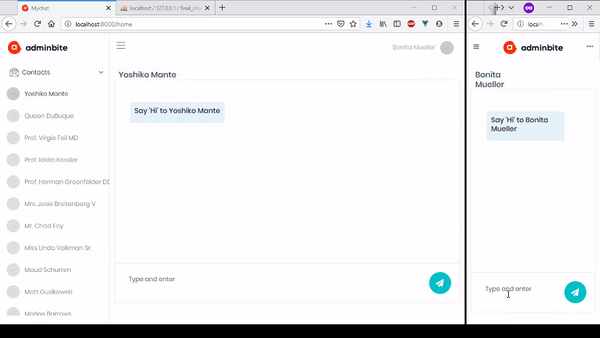

<p align="center"></p>
<p align="center"></p>

## About The Project

This is a messenger app that i made using laravel and Vue js with efficient handling of message notification.

### Features:
- Backend Framework: Laravel || Frontend Framework: Vue
- Use of Laravel Echo and Pusher for handling message notification
- Totally Based on APIs
- API security using Laravel Passport
- Use of JWT (JSON Web Token) for Laravel Authentication



# In order to use this project, clone this repository and do the following

```bash
# go into the project

# create a .env file
cp .env.example .env

# install composer dependencies
composer update

# install npm dependencies
npm install

# generate a key for your application
php artisan key:generate

# create a local MySQL database (make sure you have MySQL up and running)
mysql -u root

> create database my_chat_app;
> exit;

# add the database connection config to your .env file
DB_CONNECTION=mysql
DB_DATABASE=my_chat_app
DB_USERNAME=root
DB_PASSWORD=

# run the migration files to generate the schema
php artisan migrate

# visit https://pusher.com and create a free app. then copy the keys into your .env file
PUSHER_APP_ID=your_pusher_app_id
PUSHER_APP_KEY=your_pusher_app_key
PUSHER_APP_SECRET=your_pusher_app_secret
PUSHER_APP_CLUSTER=your_pusher_cluster

# change the BROADCAST_DRIVER in your .env to pusher
BROADCAST_DRIVER=pusher

# run webpack and watch for changes
npm run watch
